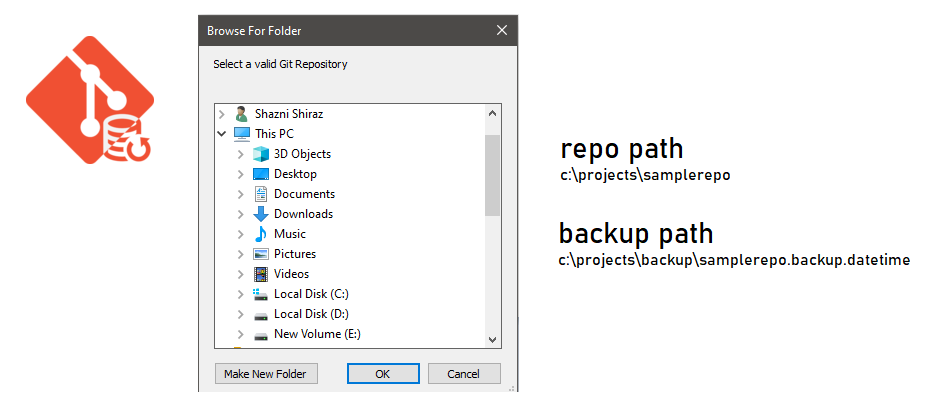
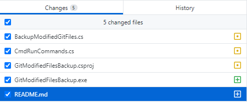

# Backup Uncommited Files in Git Repository

## Why
Sometimes I feel a need of having the files affected on my working repository to be backed up. Yes feature branching and stashing does exist, however sometimes based on my needs i just need to keep backups with the files i spoil with 😜.

Just wrote this for fun there might be other sophisticated tools but you know 😊.

## What does this app does exactly



1. Simply gets all the affected + added files from your repository and copy it  to a backup folder.
2. Can also be invoked using a scheduler task service, like if you need to backup affected files every 2 hours just to keep multiple versions.

## Prerequisites

1. Git (Obviously 😅)
2. .NET Framework 4.6.2

## Installer ⚙ [Download GitBackupUncommitedFiles Setup](Setup.GitBackupUncommitedFiles/Final/GitBackupUncommitedFiles.msi)

## Usage

Suppose you have several modified files under your repository. And you need to backup those modified/added files.



Run the GitBackupUncommitedFiles.exe (I need to change the name YES 😁) choose the repo location and confirm backup.

**Repo Location**
```
C:\Repo\GitBackupUncommitedFiles
```

**Backup Location**
```
C:\Repo\backup\GitBackupUncommitedFiles\GitBackupUncommitedFiles.backup.Sunday.18.April.2021.04.28.38
```


### Schedule Task

- Invoke the exe by passing

```
GitBackupUncommitedFiles.exe "C:\Repo\GitBackupUncommitedFiles"
//argument 01 - repositorypath
```


## Contributions
Highly welcomed! 😊


